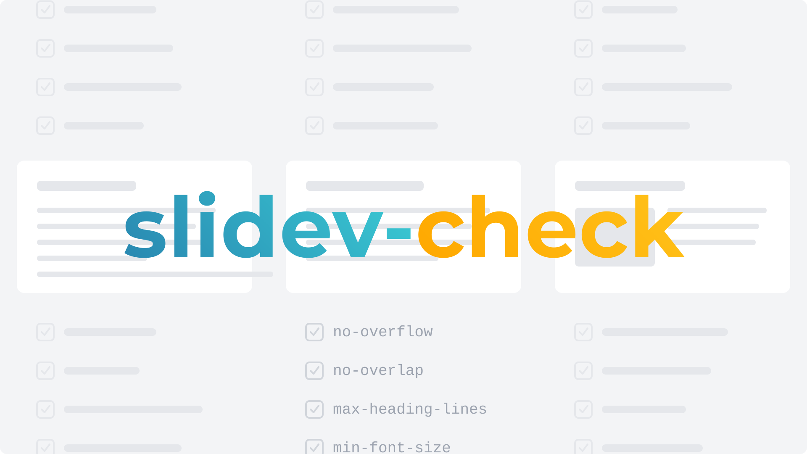
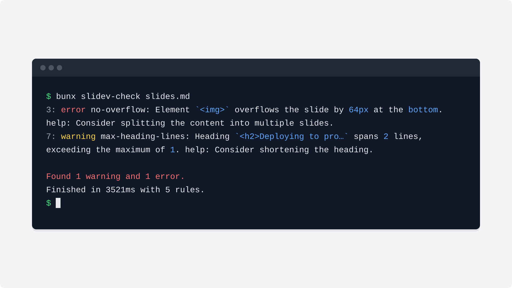

# slidev-check

[](https://www.npmjs.com/package/slidev-check)
[](https://github.com/WillBooster/slidev-check/actions/workflows/test.yml)
[](https://github.com/semantic-release/semantic-release)
[](https://github.com/WillBooster/shared/tree/main/packages/wbfy)



Audits the _rendered_ output of a [Slidev](https://sli.dev) deck and reports layout and content guideline problems, linter-style.

It is not a static analyzer: the deck is rendered by Slidev's own dev server (the same code path as `slidev export`) inside headless Chromium, and rules inspect the resulting DOM and geometry.

## Usage



```sh
bun add -d slidev-check                      # @slidev/cli and playwright-chromium are peer dependencies
bunx playwright-chromium install chromium    # once, if Chromium is not installed yet
bunx slidev-check slides.md
```

The deck is rendered with the `@slidev/cli` and theme installed in _your_ project, so the checked output matches what `slidev` itself shows.

Nothing is printed when no rule is violated. Otherwise each violation is reported with its location, cause, and a `help:` suggestion, and the exit code is `1` if any errors are found. Warnings alone keep exit code `0`:

```
3: error no-overflow: Element `<div.absolute>wide` overflows the slide by 220px at the right. help: Consider splitting the content into multiple slides.

Found 0 warnings and 1 error.
Finished in 3521ms with 8 rules.
```

Options: `--theme <name>`, `--wait <ms>`, `--timeout <ms>`, `--json`, `--fix`.

`--fix` rewrites the slide files with the fixes that rules attach to their findings and reports what remains (with `--json`, as `{ "fixed": N, "violations": [...] }`). Currently `optimal-zoom` provides fixes: for an element with an inline `zoom` style (typically a `<div style="zoom: 0.8">` around the whole slide body), it finds the largest zoom at which the content still keeps a margin (one text line by default) above the slide bottom and within the slide width, warns when the declared zoom is smaller (the content could be larger) or larger (the content is too tight, sticks out, or overflows; a zoom above 1 that still keeps the margin is left alone), and `--fix` replaces the declared value with the optimal one. Several wrappers on one slide are optimized in document order, so their fixes are consistent with each other. A slide without a wrapper whose content is too tight at zoom 1 is reported with the wrapper to add.

Add `data-slidev-check-ignore` to an element to exclude it (and its descendants) from all rules.

## Content guidelines

The following rules run by default as warnings, based on the [slide guidelines](https://github.com/WillBooster/agentic-workflows/pull/665):

| Rule                  | Limit                                       |
| --------------------- | ------------------------------------------- |
| `max-body-characters` | 200 non-whitespace characters per slide     |
| `max-list-depth`      | 2 nested list levels                        |
| `max-table-rows`      | 7 visible rows per table, including headers |

Character counts include prose, lists, code, and table text inside `.slidev-layout`, excluding headings, hidden content, and elements marked `data-slidev-check-ignore`. Unicode grapheme clusters count as single characters, including emoji and combining marks. Inline markup does not count text twice, and whitespace and DOM separators preserve character boundaries. Theme content outside the layout and speaker notes are not counted.

Custom layouts must mark their content root with `class="slidev-layout"`. Visibility checks respect display, visibility, opacity, and content-visibility; visible text inside boxless `display: contents` wrappers is counted. Text clipped or clamped by CSS still counts. Use `data-slidev-check-ignore` for intentionally excluded content. Text metrics inspect HTML and SVG text; direct native MathML is not counted, while Slidev's standard KaTeX HTML rendering is counted.

`max-table-rows` identifies each over-limit table separately. Visible empty rows count, but an empty visible descendant alone does not make a hidden row or list item visible: it must expose text or painted content.

These warnings suggest shortening or splitting content and do not provide automatic fixes. The guideline's ten-line visual budget and semantic requirements need manual review. Existing layout rules still check geometry, and `min-font-size` retains its 14 CSS pixel default rather than the guideline's 18pt.

## Development

```sh
bun run check   # type check
bun test
```

## License

Apache License &copy; WillBooster Inc.
